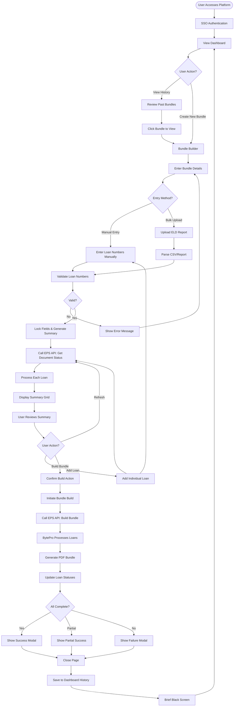
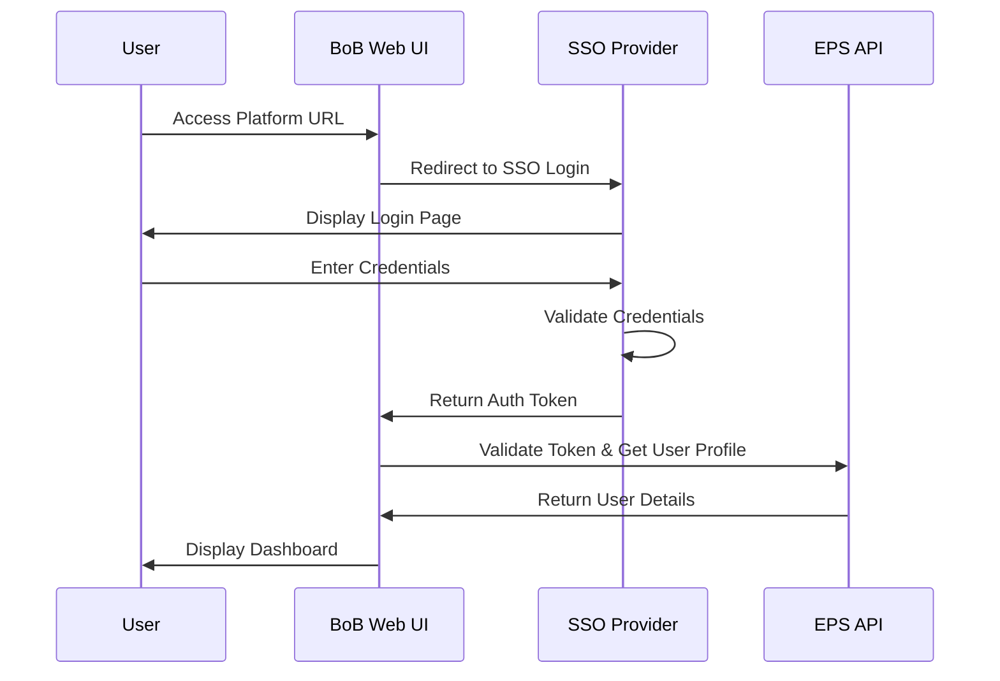
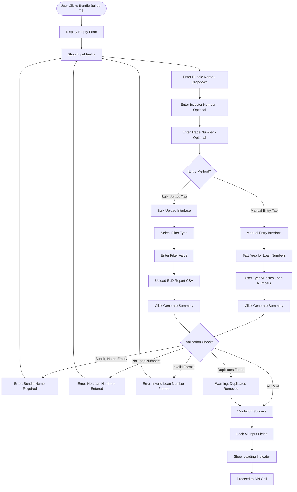
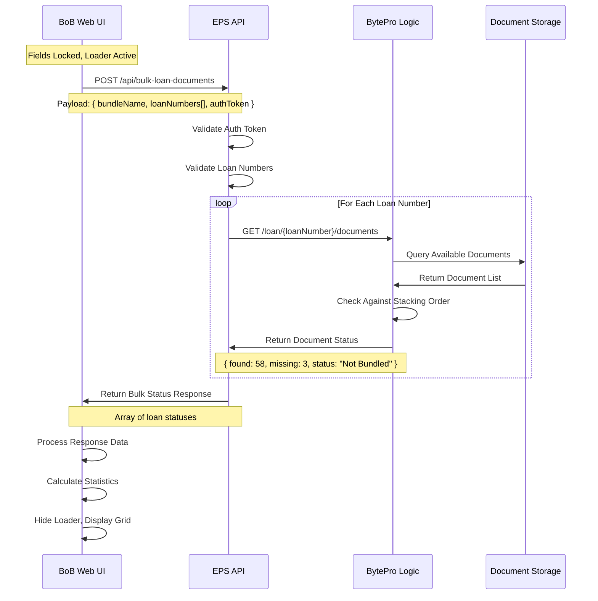
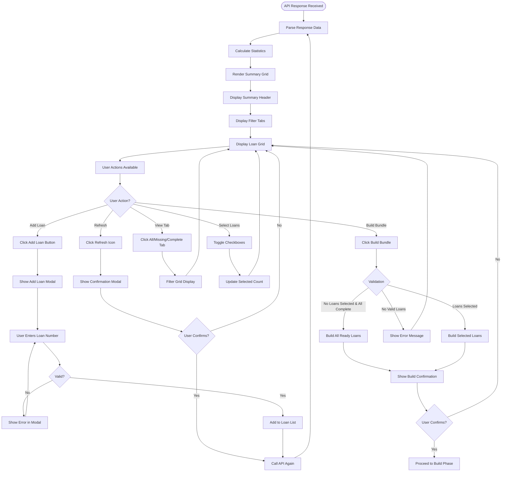
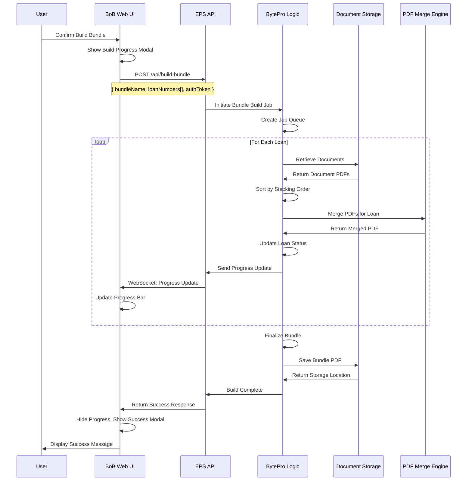
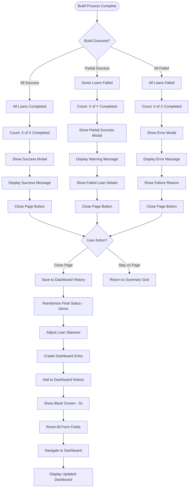
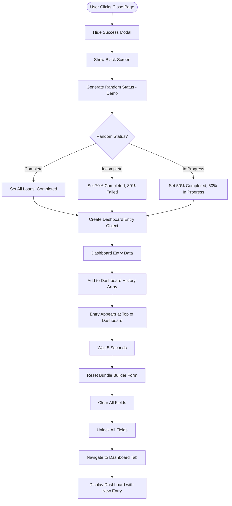
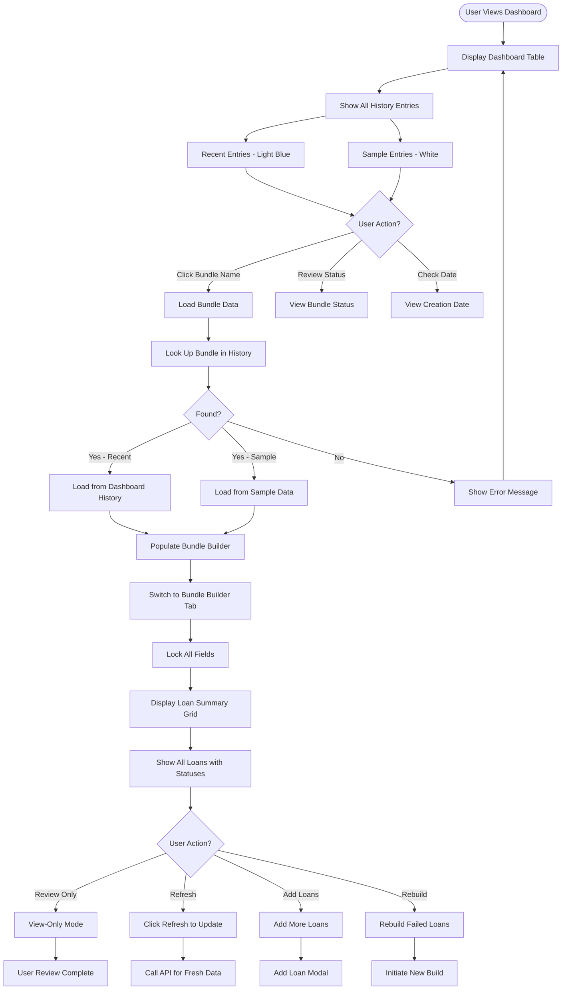
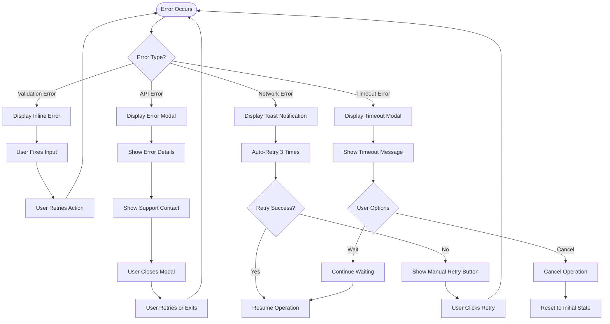

# Bulk Bundle Manager - Process Workflow Diagram

## Document Information
**Platform:** BoB (Bundle of Bundles) - Bulk Bundle Manager
**Version:** 1.0
**Created:** 2025-01-19
**Purpose:** Training & Executive Presentation
**Audience:** Stakeholders, Development Team, Training Personnel

---

## Executive Summary

The Bulk Bundle Manager is a web-based platform that streamlines the creation of mortgage loan document bundles by processing multiple loans simultaneously. The platform interfaces with CMG Financial's EPS (Enterprise Processing System) to leverage BytePro's proven bundling logic, creating investor-ready PDF packages that comply with specific stacking order requirements.

**Key Benefits:**
- Process 10-50+ loans in a single batch operation
- Automated document retrieval and validation
- Real-time status tracking per loan
- Intelligent error handling and retry capabilities
- Dashboard history for audit and review

---

## Architecture Overview

```
┌─────────────────┐      ┌──────────────┐      ┌─────────────────┐      ┌──────────────────┐
│                 │      │              │      │                 │      │                  │
│  BoB Web UI     │─────▶│  EPS API     │─────▶│  BytePro Logic  │─────▶│  PDF Bundle      │
│  (React)        │      │  (Gateway)   │      │  (Engine)       │      │  Output          │
│                 │      │              │      │                 │      │  (200-400 MB)    │
└─────────────────┘      └──────────────┘      └─────────────────┘      └──────────────────┘
     ↑                          ↑                       ↑
     │                          │                       │
     └──────────────────────────┴───────────────────────┘
              Authentication & Session Management (SSO)
```

---

## Main Process Flow (High-Level)

### Mermaid Diagram



---

## Detailed Process Flow

### Phase 1: User Authentication & Access



**Step-by-Step Description:**

1. **Initial Access**
   - User navigates to Bulk Bundle Manager URL (port 5173)
   - Platform detects no active session

2. **SSO Authentication**
   - User redirected to company SSO provider
   - User enters credentials (username/password + MFA if required)
   - SSO validates credentials against Active Directory/LDAP

3. **Token Generation**
   - SSO generates authentication token (JWT)
   - Token includes user identity, roles, and permissions
   - Token returned to BoB Web UI

4. **Session Initialization**
   - Web UI stores token securely (HttpOnly cookie or secure storage)
   - Calls EPS API to retrieve user profile (name, role, email)
   - Displays user information in header (avatar with initials)

5. **Dashboard Display**
   - User lands on Dashboard tab by default
   - Shows recent bundle history
   - Displays 4 sample bundles for demo/training

---

### Phase 2: Bundle Creation - Data Entry



**Step-by-Step Description:**

**2.1 Bundle Builder Tab Access**
- User clicks "Bundle Builder" tab in main navigation
- Form displays with empty input fields
- All fields are editable (unlocked state)

**2.2 Bundle Name Selection**
- User clicks "Bundle Name" dropdown
- List displays 100+ investor bundle options (U.S. Bank, Rocket Mortgage, etc.)
- User selects desired bundle name
- Each bundle name corresponds to a specific stacking order table in BytePro

**2.3 Optional Fields**
- **Investor Number**: Optional identifier for investor tracking
- **Trade Number**: Optional identifier for trade/batch tracking
- Both fields accept alphanumeric input (validation: no special characters)

**2.4 Entry Method Selection**

**Option A - Manual Entry:**
- User clicks "Manual Entry" tab
- Large text area appears for loan number input
- User can:
  - Type loan numbers (one per line)
  - Paste from Excel/clipboard (comma or line-separated)
  - Mix formats (system normalizes)

**Option B - Bulk Upload:**
- User clicks "Bulk Upload" tab
- Two-step process:
  1. **Filter Selection**: User selects filter type from dropdown (e.g., "ELD Report")
  2. **Filter Value**: User enters value to filter by (e.g., "12345")
  3. **File Upload**: User uploads CSV file (typically ELD Report export from LOS)
- System parses CSV and extracts loan numbers based on filter criteria

**2.5 Validation Process**
- User clicks "Generate Bulk Bundle Summary" button
- System performs validation checks:

  **Check 1: Bundle Name**
  - ❌ If empty → Error: "Please select a bundle name first"

  **Check 2: Loan Numbers**
  - ❌ If none entered → Error: "Please enter at least one loan number"

  **Check 3: Format Validation**
  - Validates each loan number format (alphanumeric, length requirements)
  - ❌ If invalid → Error: "Invalid loan number format: [list of invalid entries]"

  **Check 4: Duplicate Detection**
  - Identifies duplicate loan numbers
  - ⚠️ If found → Warning: "X duplicate loan numbers removed"
  - Automatically deduplicates list

  **Check 5: Processing**
  - Normalizes loan numbers (trim whitespace, uppercase, etc.)
  - Creates clean array of unique loan numbers

**2.6 Post-Validation**
- ✅ Validation success → Lock all input fields (prevent editing)
- Display loading spinner with message: "Loading from EPS API..."
- Disable "Generate Summary" button
- Enable "Clear" button to start over if needed

---

### Phase 3: API Integration & Document Status Retrieval



**Step-by-Step Description:**

**3.1 API Request Construction**
- Web UI prepares API call to EPS
- Endpoint: `POST /api/v1/bulk-loan-documents`
- Request payload:
  ```json
  {
    "bundleName": "U.S. Bank",
    "loanNumbers": ["USB12345", "USB12346", "USB12347", ...],
    "authToken": "Bearer eyJhbGc...",
    "requestTimestamp": "2025-01-19T10:30:00Z"
  }
  ```

**3.2 EPS Gateway Processing**
- EPS receives request and validates auth token
- Checks user permissions (authorized to create bundles?)
- Validates loan numbers against LOS (Loan Origination System)
- Confirms loans exist and are accessible to user

**3.3 BytePro Integration**
- EPS calls BytePro for each loan number (batch processing)
- BytePro queries:
  - Available documents for each loan
  - Document types (Appraisal, Title, Credit Report, etc.)
  - Document locations in storage
  - Document metadata (upload date, file size, etc.)

**3.4 Stacking Order Validation**
- BytePro retrieves stacking order table for "U.S. Bank" bundle
- Example stacking order:
  ```
  1. 1003 (Loan Application)
  2. Appraisal
  3. Title Report
  4. HOI Policy
  5. Credit Report
  ... (50+ document types)
  ```
- Compares available documents against required documents
- Calculates:
  - **Found Documents**: Documents present and ready
  - **Missing Documents**: Required documents not yet uploaded
  - **Bundle Status**: Not Bundled, Ready to Bundle, In Progress, etc.

**3.5 Response Generation**
- BytePro returns status for each loan
- EPS aggregates all loan statuses into single response
- Response format:
  ```json
  {
    "success": true,
    "loans": [
      {
        "loanNumber": "USB12345",
        "foundDocs": 58,
        "missingDocs": 3,
        "bundleStatus": "Not Bundled",
        "missingDocTypes": ["VOE", "VOD", "Closing Disclosure"]
      },
      ...
    ],
    "totalLoans": 27,
    "timestamp": "2025-01-19T10:30:15Z"
  }
  ```

**3.6 UI Response Handling**
- Web UI receives response
- Parses loan data into state
- Calculates summary statistics:
  - Total loans: 27
  - Missing documents: 15
  - Complete loans: 12
  - Average found docs: 56
- Hides loading indicator
- Displays summary grid

---

### Phase 4: Summary Grid Display & User Actions



**Step-by-Step Description:**

**4.1 Summary Header Display**
- Shows bundle metadata:
  - Bundle Name: "U.S. Bank"
  - Investor Number: "12345" (if entered)
  - Trade Number: "67890" (if entered)
- Shows summary counts in colored badges:
  - Total Loans: 27 (gray)
  - Missing Docs: 15 (red)
  - Complete: 12 (green)

**4.2 Filter Tabs**
- Three tabs for filtering loan view:
  - **All (27)**: Shows all loans
  - **Missing (15)**: Shows only loans with missing documents
  - **Complete (12)**: Shows only loans with zero missing docs
- Active tab highlighted in teal
- Numbers update dynamically as data changes

**4.3 Loan Grid Display**
- Table with columns:
  1. **Checkbox**: Select individual loans
  2. **Loan Number**: Clickable link (dark gray text)
  3. **# Missing**: Number of missing docs (red if > 0)
  4. **# Found**: Number of found docs (gray)
  5. **Status**: Bundle status badge (color-coded)
     - Not Bundled (gray)
     - Ready to Bundle (green)
     - In Progress (yellow)
     - Completed (green)
     - Bundle Failed (red)

**4.4 User Actions**

**Action A - Refresh Summary**
- User clicks refresh icon in header
- Confirmation modal: "This will re-fetch document status. Continue?"
- If confirmed:
  - Show loading indicator
  - Re-call EPS API with same loan list
  - Update grid with fresh data
  - Useful if documents were uploaded after initial load

**Action B - Add Individual Loan**
- User clicks "Add Loan" button
- Modal appears with text input
- User enters loan number
- Validation checks:
  - ❌ Empty → Error: "Please enter a loan number"
  - ❌ Duplicate → Error: "This loan is already in the summary"
  - ❌ Invalid format → Error: "Invalid loan number format"
  - ✅ Valid → Add to list and refresh API
- Modal closes automatically on success

**Action C - Filter by Tab**
- User clicks different tab (All, Missing, Complete)
- Grid filters to show only matching loans
- No API call (client-side filtering)
- Selected loan checkboxes persist across tab changes

**Action D - Select Loans**
- User can click checkboxes to select specific loans
- "Select All" checkbox in header selects all visible loans
- Selected count displays in header: "15 selected"
- Loans with status "In Progress" cannot be selected (checkbox disabled)
- Selection state persists across tab filters

**Action E - Build Bundle**
- User clicks "Build Bundle (Ready)" or "Build Bundle (Selected)"
- Two build modes:

  **Mode 1 - Build All Ready Loans**
  - Button: "Build Bundle (Ready)"
  - Builds all loans with status "Ready to Bundle"
  - Ignores user selections
  - Use case: Build all complete loans in one batch

  **Mode 2 - Build Selected Loans**
  - Button: "Build Bundle (Selected)"
  - Builds only checked loans
  - Can include loans with missing docs (user choice)
  - Use case: Build specific subset regardless of completeness

- Validation:
  - ❌ No valid loans → Error: "No loans available to build"
  - ❌ All selected have "In Progress" → Error: "Cannot build loans already in progress"
  - ✅ Valid selection → Show confirmation modal

**4.5 Build Confirmation Modal**
- Modal displays:
  - "Confirm Bundle Build"
  - Summary: "You are about to build X loans"
  - Warning if missing docs: "⚠️ Y loans have missing documents"
  - Buttons: "Yes, Build Bundle" (green) | "Cancel" (gray)
- User confirms or cancels
- On confirm → Proceed to Build Phase

---

### Phase 5: Bundle Build Process



**Step-by-Step Description:**

**5.1 Build Initiation**
- User confirms bundle build
- UI shows progress modal:
  - Title: "Building Bundle..."
  - Progress bar (animated)
  - Status text: "Processing 0 of 27 loans"
  - Cannot be dismissed during build

**5.2 API Request**
- Web UI calls EPS build endpoint
- Endpoint: `POST /api/v1/build-bundle`
- Request payload:
  ```json
  {
    "bundleName": "U.S. Bank",
    "loanNumbers": ["USB12345", "USB12346", ...],
    "buildMode": "selected",
    "authToken": "Bearer eyJhbGc...",
    "requestTimestamp": "2025-01-19T11:00:00Z"
  }
  ```

**5.3 BytePro Job Creation**
- BytePro receives build request
- Creates job in queue system
- Assigns job ID for tracking
- Returns immediate acknowledgment to EPS
- EPS returns job ID to UI for progress tracking

**5.4 Document Retrieval (Per Loan)**
- For each loan in the list:
  1. Query document storage for all documents
  2. Retrieve document metadata (file paths, types, sizes)
  3. Download document PDFs from storage
  4. Validate PDFs (not corrupted, readable)

**5.5 Stacking Order Application**
- BytePro loads stacking order table for "U.S. Bank"
- For each document in the loan:
  - Map document type to stacking order position
  - Example: "Appraisal" → Position 2
- Sort documents by stacking order position
- Handle missing documents:
  - If required doc missing → Mark loan as "Incomplete"
  - If optional doc missing → Continue without it

**5.6 PDF Merging**
- PDFEngine processes documents in order:
  1. Create new blank PDF
  2. Append documents one by one in stacking order
  3. Insert separator pages if configured
  4. Add bookmarks for navigation (optional)
  5. Compress images (if compression feature enabled)
  6. Validate final PDF integrity

**5.7 Status Updates**
- BytePro sends real-time progress updates to EPS
- EPS forwards to UI via WebSocket or polling
- UI updates:
  - Progress bar: "Processing 12 of 27 loans (44%)"
  - Individual loan statuses in grid:
    - "In Progress" → "Completed" (green check icon)
    - Or "In Progress" → "Bundle Failed" (red X icon)

**5.8 Success/Failure Handling**

**Scenario A - All Loans Successful**
- All loans merge successfully
- Final status: "Completed" for all
- Bundle PDF saved to storage (200-400 MB)
- Return success response to UI

**Scenario B - Partial Success**
- Some loans succeed, some fail
- Failures may be due to:
  - Missing required documents
  - Corrupted source documents
  - PDF merge errors
  - Timeout issues
- Successful loans: Status → "Completed"
- Failed loans: Status → "Bundle Failed"
- Return partial success response to UI

**Scenario C - Complete Failure**
- All loans fail to bundle
- Possible causes:
  - BytePro service unavailable
  - Storage system down
  - Invalid stacking order configuration
- All loans: Status → "Bundle Failed"
- Return error response to UI

**5.9 Storage & Metadata**
- Successfully bundled PDFs saved to:
  - Primary storage location (S3, Azure Blob, or network share)
  - Backup location (if configured)
- Metadata recorded:
  - Bundle name, loan numbers, timestamp
  - File size, page count
  - User who created bundle
  - Stacking order version used
- Storage location URL returned for download

---

### Phase 6: Build Completion & Results



**Step-by-Step Description:**

**6.1 Build Completion Detection**
- BytePro signals build completion to EPS
- EPS returns final response to UI
- UI closes progress modal
- UI processes build results

**6.2 Result Categorization**

**Case 1: Complete Success (All Loans Built)**
- Success modal displays:
  - ✅ Green checkmark icon
  - Title: "Bundle Build Successful"
  - Message: "Successfully built 27 of 27 loans"
  - Details: "Bundle name: U.S. Bank"
  - Button: "Close Page" (green button)

**Case 2: Partial Success (Some Failures)**
- Partial success modal displays:
  - ⚠️ Yellow warning icon
  - Title: "Bundle Build Partially Completed"
  - Message: "Successfully built 23 of 27 loans"
  - Details: "4 loans failed to build:"
    - USB12349 - Missing required documents
    - USB12352 - PDF merge error
    - USB12358 - Document corrupted
    - USB12361 - Timeout error
  - Buttons: "Close Page" (green) | "Review Failures" (gray)

**Case 3: Complete Failure (All Failed)**
- Error modal displays:
  - ❌ Red X icon
  - Title: "Bundle Build Failed"
  - Message: "0 of 27 loans were successfully built"
  - Details: "Reason: BytePro service unavailable. Please try again later."
  - Button: "Close" (red button)

**6.3 User Actions Post-Build**

**Action A - Close Page**
- User clicks "Close Page" button
- Triggers dashboard save process (see Phase 7)
- Saves bundle to dashboard history
- Resets form and navigates to dashboard

**Action B - Review Failures**
- Available only for partial success
- User clicks "Review Failures"
- Modal closes
- Summary grid remains visible
- Failed loans highlighted in red
- User can:
  - Review which loans failed
  - Fix issues (upload missing docs)
  - Click "Refresh Summary" to re-check
  - Re-build failed loans only

**Action C - Stay on Page**
- User closes modal without clicking "Close Page"
- Remains on Bundle Builder tab
- Summary grid shows updated statuses
- User can:
  - Add more loans
  - Refresh summary
  - Build additional bundles

**6.4 Grid Status Updates**
- After build completion, loan statuses updated in grid:
  - "In Progress" → "Completed" (successful loans)
  - "In Progress" → "Bundle Failed" (failed loans)
- Status badges color-coded:
  - Completed: Green badge
  - Bundle Failed: Red badge
- Failed loans show tooltip on hover with failure reason

---

### Phase 7: Dashboard Save & History



**Step-by-Step Description:**

**7.1 Close Page Initiation**
- User clicks "Close Page" button in success modal
- Success modal closes
- Black screen overlay appears (simulates page close)

**7.2 Dashboard Entry Creation**
- System captures current bundle state:
  - Bundle name: "U.S. Bank"
  - Loan count: 27
  - Timestamp: Current date/time
  - Loan data: Complete array of loan statuses

**7.3 Demo Randomization (Current Implementation)**
- For demo purposes, final status randomized:

  **Option 1: Complete (33% probability)**
  - All loans set to "Completed" status
  - Dashboard status: "Complete"

  **Option 2: Incomplete (33% probability)**
  - 70% of loans: "Completed"
  - 15% of loans: "Bundle Failed"
  - 15% of loans: "Not Bundled"
  - Dashboard status: "Incomplete"

  **Option 3: In Progress (33% probability)**
  - 50% of loans: "Completed"
  - 50% of loans: "In Progress"
  - Dashboard status: "In progress"

**7.4 Dashboard Entry Object**
```javascript
{
  bundleName: "U.S. Bank",
  loanCount: 27,
  timestamp: "2025-01-19T11:15:30Z",
  status: "Complete", // or "Incomplete" or "In progress"
  loans: [
    { id: "USB12345", bundleStatus: "Completed", missingDocs: 0, foundDocs: 58 },
    { id: "USB12346", bundleStatus: "Completed", missingDocs: 0, foundDocs: 61 },
    // ... all 27 loans
  ]
}
```

**7.5 Add to Dashboard History**
- Entry added to beginning of `dashboardHistory` array
- Most recent entries appear first
- Entry highlighted with light blue background (bg-blue-50)
- Entry is clickable hyperlink to reload bundle

**7.6 Auto-Cleanup (24-Hour Rule)**
- Every time dashboard loads, cleanup runs:
  - Check all `dashboardHistory` entries
  - Compare timestamp to current time
  - Remove entries older than 24 hours
  - Keep only recent demo data
- Sample bundles (4 hardcoded) always remain
- Cleanup runs silently in background

**7.7 Reset & Navigation**
- After 5-second black screen:
  - Reset all form fields to empty
  - Unlock all input fields (allow new bundle)
  - Clear loan summary grid
  - Clear any error messages
  - Reset tabs to default state
  - Navigate to Dashboard tab
  - Display updated dashboard with new entry

**7.8 Dashboard Display**
- Dashboard shows:
  - New entry at top (light blue background)
  - Recent entries below (white background)
  - 4 sample entries at bottom (white background)
- Each entry shows:
  - Bundle name (clickable hyperlink)
  - Date/time (formatted: "MM/DD/YY H:MM am/pm EST")
  - Loan count
  - Status (color-coded text)

---

### Phase 8: Dashboard Interaction & History Review



**Step-by-Step Description:**

**8.1 Dashboard View**
- User on Dashboard tab
- Table displays all bundle history:

  **Header Row:**
  - Bundle Name
  - Latest Build Date/Time
  - Number of Loans
  - Bulk Bundle Status

  **Entry Rows:**
  1. **Recent History** (top, light blue background)
     - Created within last 24 hours
     - From actual user builds in current session
     - Clickable bundle names

  2. **Sample Data** (bottom, white background)
     - 4 hardcoded sample bundles
     - Always present for demo/training
     - Clickable bundle names

**8.2 Footer Note**
- Below table, small gray text:
  - "Note: Dashboard history entries will be retained for 10 business days and automatically removed thereafter."
  - (Demo: Actually cleaned up every 24 hours)

**8.3 Bundle Name Click Action**
- User clicks bundle name hyperlink
- System searches for bundle data:

  **Step 1: Check Recent History**
  - Search `dashboardHistory` array
  - Match by: `bundleName-loanCount-status`
  - Example: "U.S. Bank-27-Complete"

  **Step 2: Check Sample Data**
  - If not in recent history, check `sampleBundleData` object
  - Sample bundles have predefined loan data

  **Step 3: Not Found**
  - If neither found: Show error toast
  - Error: "Bundle data not found"

**8.4 Load Bundle Data**
- When bundle found:
  1. Extract bundle metadata:
     - Bundle name
     - Loan count
     - Loan array (with statuses)

  2. Populate Bundle Builder form:
     - Set bundle name in dropdown
     - Pre-populate loan numbers
     - Lock all input fields

  3. Switch to Bundle Builder tab

  4. Display loan summary grid:
     - Show all loans with their statuses
     - Apply status colors (green for complete, red for failed, etc.)
     - Show missing/found doc counts

  5. Enable user actions:
     - Refresh summary
     - Add more loans
     - Build additional bundles

**8.5 View-Only Mode**
- User can review historical bundle:
  - See which loans were included
  - Check which loans completed/failed
  - Review missing document counts
  - Understand bundle composition
- Useful for:
  - Auditing past builds
  - Training new users
  - Understanding bundle requirements
  - Troubleshooting issues

**8.6 Additional Actions**
- From loaded historical bundle, user can:

  **Action A - Refresh Data**
  - Click "Refresh Summary" icon
  - Re-fetch current document status
  - See if missing docs have been uploaded since build
  - Update grid with latest data

  **Action B - Add Loans**
  - Click "Add Loan" button
  - Enter additional loan numbers
  - Refresh summary with new loans
  - Build expanded bundle

  **Action C - Rebuild Failed**
  - If bundle had failures
  - Fix issues (upload missing docs)
  - Select failed loans only
  - Re-run build process

  **Action D - Create Similar Bundle**
  - Use historical bundle as template
  - Modify loan list
  - Create new bundle with similar configuration

---

## Error Handling & Edge Cases

### Common Error Scenarios



**Error Scenarios & Handling:**

**1. Invalid Loan Number Format**
- **When**: User enters loan number with special characters
- **Detection**: Client-side validation before API call
- **Display**: Red error text below input field
- **Message**: "Invalid loan number format: [specific issues]"
- **Recovery**: User corrects input and retries

**2. No Bundle Name Selected**
- **When**: User tries to generate summary without selecting bundle
- **Detection**: Client-side validation on button click
- **Display**: Error toast notification (top-right)
- **Message**: "Please select a bundle name first"
- **Recovery**: User selects bundle and retries

**3. Duplicate Loan Numbers**
- **When**: User enters same loan number multiple times
- **Detection**: Client-side before API call
- **Display**: Warning toast notification
- **Message**: "5 duplicate loan numbers removed"
- **Recovery**: Automatic deduplication, user continues

**4. EPS API Unavailable**
- **When**: EPS service is down or unreachable
- **Detection**: API call timeout or error response
- **Display**: Error modal with retry option
- **Message**: "Unable to connect to document service. Please try again."
- **Recovery**: Auto-retry 3 times, then manual retry button

**5. BytePro Service Error**
- **When**: BytePro cannot process bundle build
- **Detection**: Error response from EPS
- **Display**: Error modal with details
- **Message**: "Bundle build failed: [specific error from BytePro]"
- **Recovery**: User contacts support or retries later

**6. Loan Not Found in LOS**
- **When**: Loan number doesn't exist in system
- **Detection**: API validation response
- **Display**: Warning in summary grid
- **Message**: Loan row shows "Loan not found" status
- **Recovery**: User removes invalid loan and continues

**7. Authentication Token Expired**
- **When**: User session expires during operation
- **Detection**: 401 Unauthorized response from API
- **Display**: Modal prompting re-authentication
- **Message**: "Your session has expired. Please log in again."
- **Recovery**: Redirect to SSO login, preserve form state if possible

**8. Build Timeout**
- **When**: Build takes longer than expected (e.g., > 10 minutes)
- **Detection**: Client-side timeout or server timeout response
- **Display**: Timeout modal with options
- **Message**: "Build is taking longer than expected. Continue waiting or cancel?"
- **Recovery**: User can continue waiting or cancel and check dashboard later

**9. Partial Build Failure**
- **When**: Some loans build successfully, others fail
- **Detection**: Build completion with mixed statuses
- **Display**: Partial success modal with failure details
- **Message**: "23 of 27 loans built successfully. 4 loans failed: [list]"
- **Recovery**: User reviews failures, fixes issues, rebuilds failed loans

**10. Storage Full**
- **When**: PDF cannot be saved due to storage constraints
- **Detection**: Storage error response from BytePro
- **Display**: Error modal with severity indicator
- **Message**: "Bundle built but could not be saved. Contact administrator."
- **Recovery**: User contacts support, IT team resolves storage issue

---

## Performance Considerations

### Optimization Strategies

**1. Batch API Calls**
- Don't call API for each loan individually
- Send all loan numbers in single request
- BytePro processes loans in parallel
- Reduces total API call time from minutes to seconds

**2. Async Processing**
- Bundle build runs asynchronously
- UI remains responsive during build
- Progress updates via WebSocket or polling
- User can navigate away and check status later

**3. Caching**
- Cache stacking order tables (rarely change)
- Cache user session data
- Cache document metadata for quick lookups
- Reduce redundant API calls

**4. Lazy Loading**
- Dashboard loads summary data first
- Full bundle details loaded only when clicked
- Improves initial page load time

**5. Debouncing**
- Manual entry text area debounced (300ms)
- Prevents excessive validation on every keystroke
- Improves UI responsiveness

**6. Virtual Scrolling**
- For bundles with 100+ loans
- Render only visible rows in grid
- Dramatically improves performance for large datasets

---

## Security Considerations

### Security Measures

**1. Authentication**
- SSO integration (no passwords stored in BoB)
- Token-based auth (JWT)
- Tokens expire after session timeout
- Refresh tokens for extended sessions

**2. Authorization**
- Role-based access control (RBAC)
- Users can only access loans they have permission to view
- Bundle creation permissions enforced by EPS
- Audit logs for all bundle operations

**3. Data Validation**
- All user input sanitized and validated
- SQL injection prevention (parameterized queries)
- XSS prevention (React auto-escaping)
- CSRF tokens for state-changing operations

**4. Secure Communication**
- All API calls over HTTPS/TLS
- Certificate pinning for production
- Encrypted tokens (JWT with signature verification)

**5. Data Privacy**
- No loan documents stored in browser
- Session data cleared on logout
- No sensitive data in localStorage
- Documents transmitted securely to browser only when viewed

**6. Audit Trail**
- All bundle builds logged with user ID, timestamp
- Failed login attempts tracked
- API access logged for compliance
- Audit logs retained per regulatory requirements

---

## Production vs. Demo Differences

### Current Demo Behaviors

**1. Dashboard History Cleanup**
- **Demo**: 24-hour retention (cleared daily)
- **Production**: 10 business day retention

**2. Random Bundle Status**
- **Demo**: Final status randomized (Complete/Incomplete/In Progress)
- **Production**: Actual status based on loan build results

**3. Black Screen Transition**
- **Demo**: 5-second black screen simulates page close
- **Production**: Actual window close or navigation to external system

**4. Sample Data**
- **Demo**: 4 hardcoded sample bundles always present
- **Production**: Only real user-created bundles in dashboard

**5. Document Status**
- **Demo**: Randomized found/missing document counts
- **Production**: Real document status from BytePro/LOS

**6. Build Time**
- **Demo**: Simulated 3-second build delay
- **Production**: Actual build time (varies by bundle size, typically 30s-5min)

---

## Integration Points

### Key System Integrations

**1. SSO Provider**
- **Purpose**: User authentication
- **Protocol**: SAML 2.0 or OAuth 2.0
- **Data Flow**: User credentials → SSO → Auth token → BoB

**2. EPS API Gateway**
- **Purpose**: Central API hub for all backend operations
- **Endpoints**:
  - `POST /api/v1/bulk-loan-documents` - Get document status
  - `POST /api/v1/build-bundle` - Initiate bundle build
  - `GET /api/v1/bundle-status/{jobId}` - Check build progress
  - `GET /api/v1/user/profile` - Get user details
- **Protocol**: REST over HTTPS
- **Auth**: Bearer token in Authorization header

**3. BytePro Logic Engine**
- **Purpose**: Core bundling and PDF merging logic
- **Access**: Via EPS API (no direct access from UI)
- **Responsibilities**:
  - Stacking order management
  - Document retrieval
  - PDF merging
  - Bundle status tracking

**4. Document Storage**
- **Purpose**: Store source documents and generated bundles
- **Technology**: S3, Azure Blob, or network file share
- **Access**: Via BytePro only (not directly from UI)

**5. LOS (Loan Origination System)**
- **Purpose**: Source of truth for loan data
- **Integration**: Via EPS API
- **Data**: Loan validation, borrower info, loan status

---

## Monitoring & Observability

### Key Metrics to Track

**1. Performance Metrics**
- Average bundle build time
- API response times
- Page load times
- Error rates by endpoint

**2. Business Metrics**
- Number of bundles created per day
- Average loans per bundle
- Success/failure rates
- Most popular bundle types

**3. User Metrics**
- Daily/monthly active users
- Average session duration
- Feature adoption rates
- User errors and retry patterns

**4. System Health**
- EPS API uptime
- BytePro service availability
- Storage capacity utilization
- Network latency

---

## Future Enhancements

### Planned Features

**1. Batch Build Status Dashboard**
- Real-time view of all running bundle builds
- Progress bars for each bundle
- Ability to pause/resume/cancel builds

**2. Advanced Filtering**
- Filter dashboard by date range
- Search bundles by loan number
- Filter by status (Complete/Incomplete/In Progress)

**3. Export Capabilities**
- Export bundle list to Excel
- Export loan summary to CSV
- Generate PDF reports of bundle history

**4. Notification System**
- Email notifications when build completes
- SMS alerts for failures
- In-app notification center

**5. Template Management**
- Save common bundle configurations as templates
- Quick-build from templates
- Share templates across team

**6. Bulk Actions**
- Delete multiple dashboard entries
- Rebuild multiple failed bundles
- Archive old bundles

---

## Appendix A: Sample Stacking Order

### Example: U.S. Bank Bundle

| Order | Document Type | Required? |
|-------|--------------|-----------|
| 1 | 1003 (Loan Application) | Yes |
| 2 | Appraisal | Yes |
| 3 | Title Report | Yes |
| 4 | Title Insurance | Yes |
| 5 | HOI Policy | Yes |
| 6 | Credit Report | Yes |
| 7 | VOE (Verification of Employment) | Yes |
| 8 | VOD (Verification of Deposit) | Yes |
| 9 | Pay Stubs | Yes |
| 10 | W-2s | Yes |
| 11 | Tax Returns | Yes |
| 12 | Bank Statements | Yes |
| 13 | Purchase Agreement | Yes |
| 14 | Closing Disclosure | Yes |
| 15 | Note | Yes |
| 16 | Deed of Trust | Yes |
| 17 | Flood Certification | Yes |
| 18 | Homeowners Association Docs | No |
| 19 | Gift Letter | Conditional |
| 20 | Subordination Agreement | Conditional |
| ... | ... | ... |
| 58 | Final Document | Yes |

**Total Possible Documents**: 58-65 (varies by loan type)

---

## Appendix B: Glossary

**BoB**: Bundle of Bundles - The platform name
**EPS**: Enterprise Processing System - CMG Financial's API gateway
**BytePro**: Legacy bundling system with proven logic
**Stacking Order**: Specific sequence documents must appear in final bundle
**LOS**: Loan Origination System - Source of loan data
**SSO**: Single Sign-On - Authentication system
**VOE**: Verification of Employment
**VOD**: Verification of Deposit
**HOI**: Homeowners Insurance
**ELD Report**: Export Loan Data report from LOS

---

## Document Metadata

**Document Type**: Process Workflow Diagram
**Format**: Markdown with Mermaid diagrams
**Total Pages**: (When printed)
**Last Updated**: 2025-01-19
**Version**: 1.0
**Status**: Ready for Review
**Next Review Date**: TBD

---

**End of Workflow Documentation**
